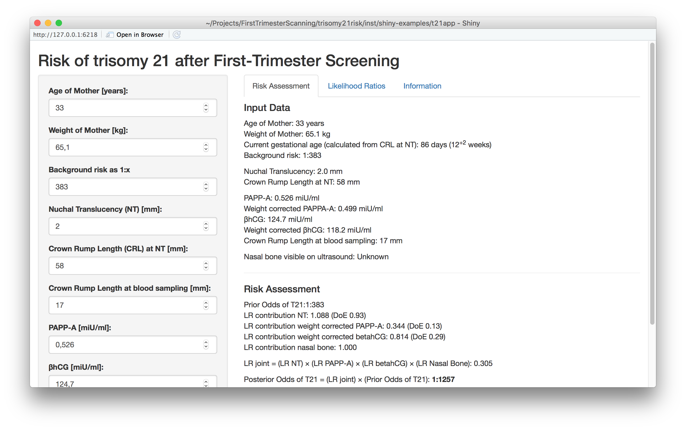

# trisomy21risk

Shiny App to Perform and Visualise the Risk Calculation for T21 from a
First Trimester Combined Test

The calculation and visualization of the trisomy 21 (Down's syndrome)
risk calculation from the biomarkers of a first trimester combined
test follows the FMF-Germany algorithm described in Merz et al. (2016)
<doi:10.1055/s-0035-1569403>. Aim of the app is to visualize the
information provided by the three biomarkers

* nuchal translucency
* concentration of the PAPP-A protein in maternal serum
* concentration of the β-HCG protein in maternal serum)

for educational and transparency purposes. The app provides
comparable, but in no way identical, values to the PRC 3.0 software by
Merz et al. (2016). Please note: Use of the app is no replacement for
the actual supervised calculations performed by such software nor for
the subsequent consultation with a gynaecologist. Absolutely no
warranty is given for the results.

To demo the package run the Shiny App by:

    devtools::install_github("hoehleatsu/trisomy21risk")
    library(trisomy21risk)
    trisomy21risk::runExample()

Instead of installing the package one can also run the Shiny App directly from
[https://hoehle.shinyapps.io/t21app/](https://hoehle.shinyapps.io/t21app/).

For further details about the classification algorithm and the motivation to write such a shiny app see the blog post [Retracing prenatal testing algorithms ](https://staff.math.su.se/hoehle/blog/2018/06/14/prc.html).

## Screenshots of the Shiny App

